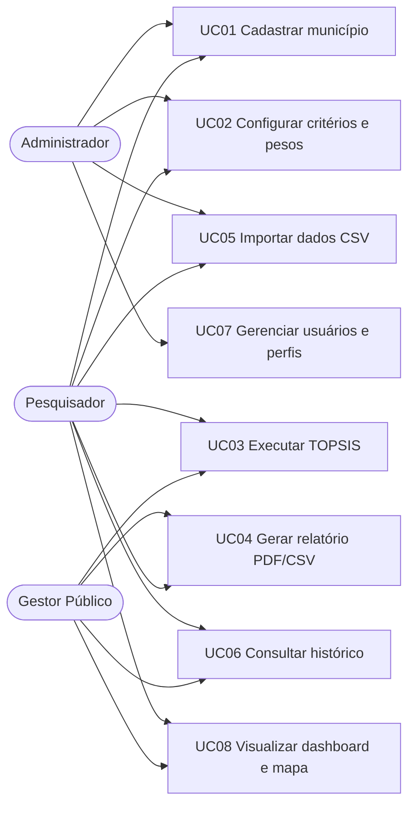
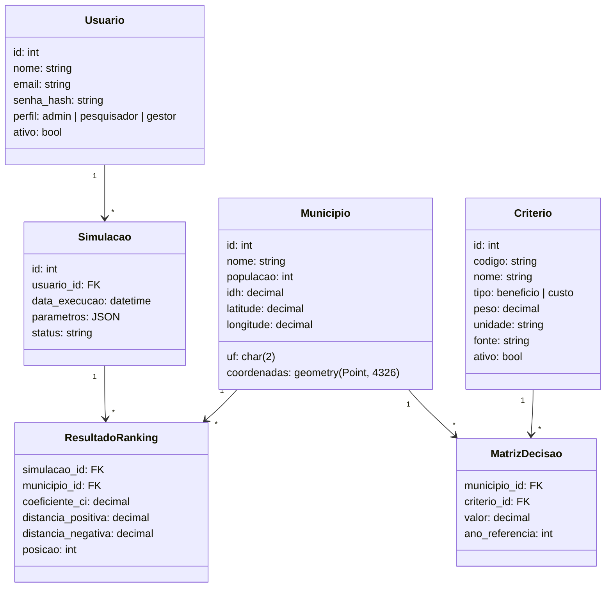
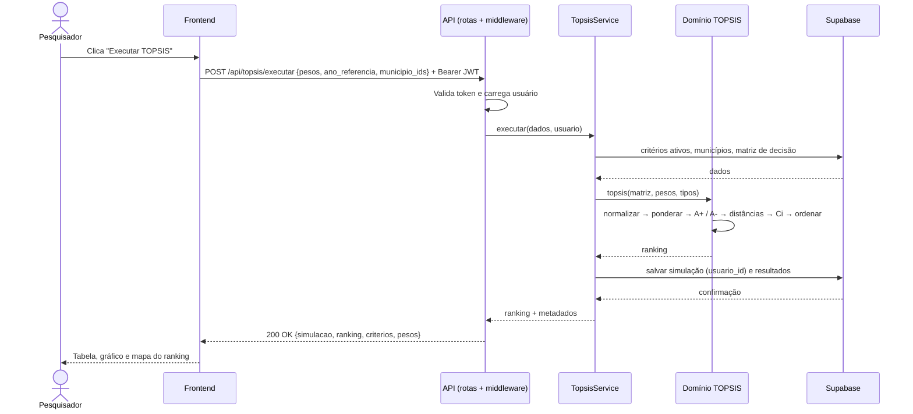
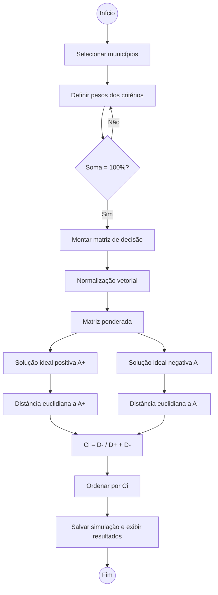
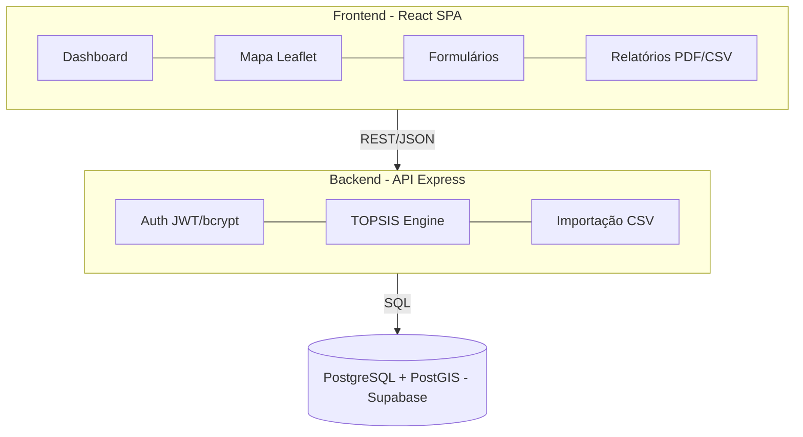
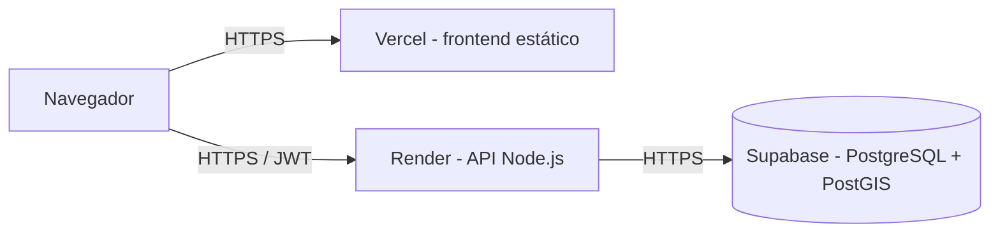

# Diagramas UML

Os diagramas usam [Mermaid](https://mermaid.js.org/) e são exibidos diretamente pelo GitHub.

## Casos de uso

Pré-condição de todos os casos de uso: usuário autenticado.

## Classes (modelo de dados)

## Sequência — executar TOPSIS

## Atividades — fluxo TOPSIS

## Componentes

## Implantação

